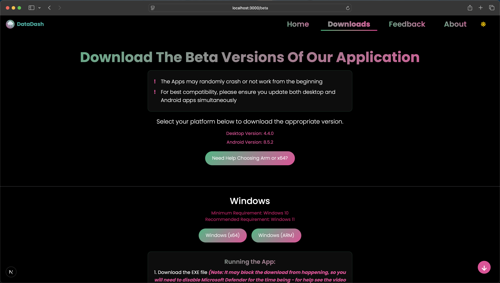
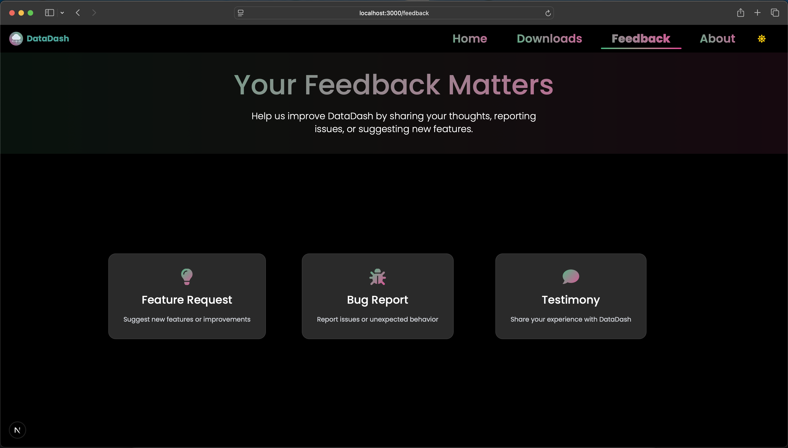

# DataDash Website

The official website for the [DataDash](https://github.com/Armaan4477/DataDash) cross-platform file sharing application. This website provides information about the application, download links, support resources, and a feedback system.

## Overview

DataDash is a local network file sharing application that works seamlessly across Android, Windows, macOS, and Linux. The website serves as the central hub for users to learn about the application, download it for their platform, provide feedback, and get help. It also host the api for the application which is used to check for updates and download the latest version of the application.


    Homepage Screenshot


    Download Page Screenshot


    Beta Page Screenshot


    About Page Screenshot
    

    Feedback Page Screenshot

## Features

- **Platform-specific Downloads**: Direct download links for Windows, macOS, Linux, and Android versions
- **Responsive Design**: Works on mobile, tablet, and desktop devices
- **Dark/Light Mode**: Automatic theme detection with manual toggle option
- **Feedback System**: User feedback form with file attachment capabilities
- **About Page**: Information about the development team
- **Beta Program**: Access to beta versions of the application

## Tech Stack

- **Framework**: Next.js 15
- **UI Library**: React 19
- **Styling**: TailwindCSS 4
- **Animation**: Framer Motion
- **Form Handling**: EmailJS
- **File Storage**: S3-compatible storage (Tebi.io)
- **Deployment**: Vercel

## Getting Started

### Prerequisites

- Node.js 20.x or later
- npm or yarn

### Installation

1. Clone the repository:
   ```bash
   git clone https://github.com/your-username/DataDash_website.git
   cd DataDash_website
   ```

2. Install dependencies:
   ```bash
   npm install
   # or
   yarn
   ```

3. Set up environment variables:
   - Copy `.env.local.example` to `.env.local`
   - Fill in the necessary environment variables

4. Run the development server:
   ```bash
   npm run dev
   # or
   yarn dev
   ```

5. Open [http://localhost:3000](http://localhost:3000) in your browser to see the result.

## Environment Variables

Create a `.env.local` file in the root directory with the following variables:

```
# EmailJS Configuration
NEXT_PUBLIC_EMAILJS_SERVICE_ID=your_service_id
NEXT_PUBLIC_EMAILJS_TEMPLATE_ID=your_template_id
NEXT_PUBLIC_EMAILJS_KEY=your_public_key

# S3 Storage Configuration
S3_ACCESS_KEY_ID=your_s3_access_key
S3_ACCESS_KEY_SECRET=your_s3_secret_key
```

See `.env.local.example` for more details.

## Project Structure

```
DataDash_website/
├── public/
│   ├── photos/       # Images for the website
│   └── videos/       # Video tutorials and demos
├── src/
│   ├── app/          # Next.js app router pages
│   │   ├── about/    # About page
│   │   ├── api/      # API routes
│   │   ├── beta/     # Beta downloads page
│   │   ├── download/ # Downloads page
│   │   ├── feedback/ # Feedback page
│   │   └── globals.css # Global styles
│   ├── components/   # Reusable components
│   ├── context/      # React contexts
│   └── lib/          # Utility functions
├── .env.local        # Environment variables (not in repo)
├── next.config.js    # Next.js configuration
├── package.json      # Project dependencies
└── tailwind.config.js # Tailwind CSS configuration
```

## Development

### Styling

This project uses Tailwind CSS v4 with custom utilities and theme configurations. Global styles are defined in `src/app/globals.css`.

### Adding New Pages

1. Create a new directory in `src/app/` with the page name
2. Add a `page.js` file with the React component

### Component Structure

- Components are organized by function in the `src/components/` directory
- Context providers are in `src/context/`
- Utilities and services are in `src/lib/`

## Deployment

The website is configured for deployment on Vercel. To deploy:

1. Push changes to the main branch
2. Vercel will automatically build and deploy the website
3. Ensure all environment variables are set in the Vercel dashboard

Note: Make sure to setup the vercel project for the first time with the correct environment variables.

### For manual deployment:

```bash
npm run build
npm start
```

## Contributing

1. Fork the repository
2. Create a feature branch: `git checkout -b feature/amazing-feature`
3. Commit your changes: `git commit -m 'Add amazing feature'`
4. Push to the branch: `git push origin feature/amazing-feature`
5. Open a Pull Request

## License

This project is licensed under the MIT License - see the [LICENSE](LICENSE) file for details.

## Contact

For questions or support, please open an issue on GitHub or contact the development team through the feedback form on the website.

